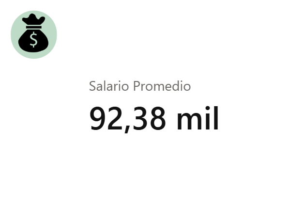
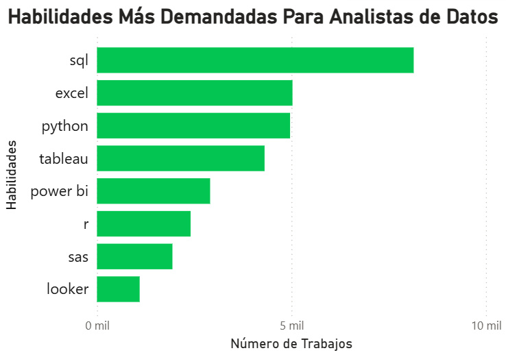
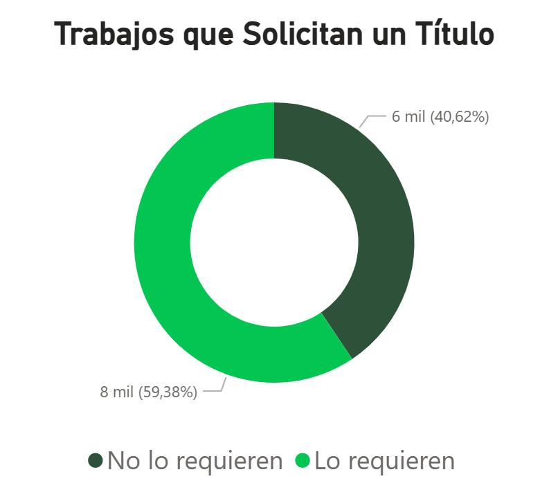
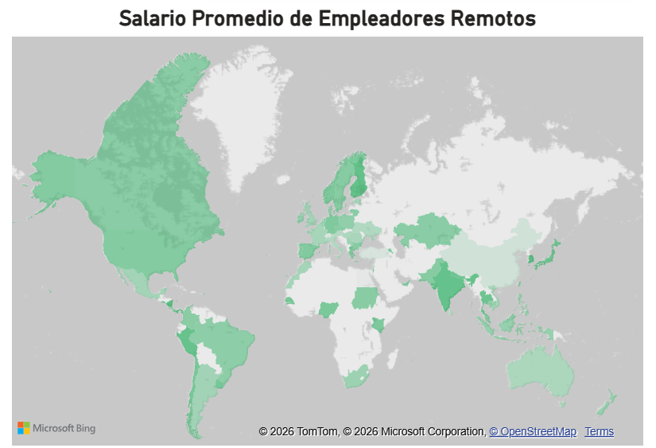
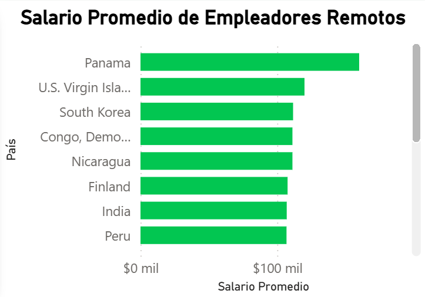

# Análisis de Mercado: Requisitos y Tendencias en Data Analytics en México
## Introducción
Se analizó una base de datos con trabajos provenientes de distintas fuentes (LinkedIn, Indeed, BeBee, etc.), 
empleando herramientas como PostgreSQL y PowerBI a fin de poder conocer aquellas habilidades más comúnes que 
requiere un analista de datos y conocer más datos al respecto.

## Justificación
Dada la bastedad de softwares que existen que pueden ser usados en el análisis de datos, es complicado para
aquellos que comenzamos en el área decidir sobre cuáles priorizar para mejorar como analista y poder ingresar
al mercado laboral. Es por ello que se realizó este análisis, para que aquellos que apenas comenzamos en esta profesión
podamos conocer las habilidades más empleadas, así como otros datos que puedan ser de utilidad. 

### Preguntas a responder

* ¿Qué habilidades son las más demandadas en el mercado laboral para los analistas de datos?
* ¿Cuánto gana un analista de datos en promedio?
* ¿Es necesario un título universitario afín para poder trabajar en análisis de datos?
* ¿Qué empleadores pagan los mejores salarios en trabajos remotos?

## Metodología

### Base de Datos
La base de datos que se utilizó fue desarrollada por [Luke Barousse](https://github.com/lukebarousse), la cual puedes encontrar [aquí](https://drive.google.com/drive/folders/1moeWYoUtUklJO6NJdWo9OV8zWjRn0rjN).

### Herramientas Utilizadas
Para la ejecución de este análisis integral, implementé un ecosistema de herramientas que garantiza la integridad, el rigor estadístico y la escalabilidad de los datos:

* **SQL:** Constituye el pilar analítico del proyecto, utilizado para la estructuración de consultas complejas y la extracción de métricas clave.

* **PostgreSQL:** Sistema de gestión de bases de datos (RDBMS) seleccionado por su robustez en el manejo y organización de grandes volúmenes de registros laborales.

* **Power BI:** Herramienta principal de Business Intelligence utilizada para transformar datos crudos en dashboards interactivos, facilitando la identificación de tendencias mediante visualizaciones dinámicas y mapas coropléticos.

* **Visual Studio Code:** Mi entorno de desarrollo principal para la optimización de scripts SQL y la administración de la base de datos mediante extensiones integradas.

* **Git & GitHub:** Herramientas críticas para el control de versiones y el despliegue del repositorio, asegurando la trazabilidad del código y la transparencia en la metodología aplicada.

## Resultados

### Salario Promedio
Para poder obtener un resultado acertado sobre el salario promedio se realizó un CTE con la media y la desviación estándar general para a posteriori poder calcular la media con los datos dentro de 3 desviaciones estándar, eliminando así los **Outliers**, incluyendo al 99.7% de los datos.
~~~SQL
-- CTE con las estadísticas
WITH salary_stats AS (
    SELECT 
        avg(salary_year_avg) as global_avg,
        stddev(salary_year_avg) as global_stddev
    FROM 
        job_postings_fact
    WHERE 
        job_title LIKE '%Data Analyst%' AND 
        job_no_degree_mention = FALSE AND
        (job_country = 'Mexico' OR job_location = 'Anywhere') AND
        salary_year_avg IS NOT NULL
)
SELECT
    ROUND(avg(salary_year_avg), 2) AS average_salary
FROM
    job_postings_fact, 
    salary_stats
WHERE
    job_title LIKE '%Data Analyst%' AND 
    job_no_degree_mention = FALSE AND
    (job_country = 'Mexico' OR job_location = 'Anywhere') AND
    salary_year_avg IS NOT NULL AND
-- Filtro con 3 desviaciones estándar para cubrir 99.7% de los resultados
    salary_year_avg BETWEEN (global_avg - 2 * global_stddev) 
                        AND (global_avg + 2 * global_stddev)
);
~~~
El resultado obtenido fue de **92,380 dólares anuales** en promedio de ganancia para un analista de datos en trabajos que se pueden consguir de forma local en México o desde México de forma remota.  

De igual forma, para conocer a priori si existían outliers, se revisaron con un [SQL](SQL\4_top_paying.sql) los trabajos mejor pagados y los peor pagados (haciendo el cambio en el **ORDER BY** de **DESC** a **ASC** con el fin de optimizar la tarea) para analistas de datos, fue así como se observó que había unos pocos salarios que salían muy lejos de la muestra, llegando hasta 650 mil dólares al año, concluyendo que sí eran necesario filtrar los **Outliers**.

### Habilidades Más Demandadas
El código utilizado para obtener estos datos se encuentra [aquí](SQL/1_skills_demand.sql).  

De los resultados obtenidos podemos observar lo siguiente:

1. **SQL - La habilidad más demandada**

    SQL aparece claramente como la habilidad número uno.

    Indica que la mayoría de los analistas:

    * Trabajan con bases de datos relacionales

    * Necesitan extraer, transformar y agregar datos constantemente

    * Es transversal a industrias, países y niveles de seniority.

    Lectura del mercado:
SQL no es un “plus”, es un requisito base. Incluso analistas junior suelen necesitarlo desde el primer día.

2. **Excel - Herramienta clave para el día a día**

    Excel ocupa el segundo lugar, con una demanda muy alta.

    Sigue siendo esencial para:

    * Análisis rápidos

    * Reportes operativos

    * Validaciones de datos

    * Es especialmente valorado en entornos de negocio tradicionales.

    Lectura del mercado:
Aunque existen herramientas más avanzadas, Excel sigue siendo imprescindible por su flexibilidad y adopción universal.

3. **Python - Puente entre análisis y automatización**

    Python aparece muy cerca de Excel.

    Se utiliza para:

    * Limpieza de datos

    * Automatización de procesos

    * Análisis más complejo

    Suele marcar la diferencia entre un analista “operativo” y uno más técnico.

    Lectura del mercado:
Python se consolida como el lenguaje estándar para analistas que quieren ir más allá de SQL y Excel.

4. **Tableau - Visualización avanzada y storytelling**

    Tableau es la herramienta de BI más demandada en el gráfico.

    Se valora por:

    * Visualizaciones avanzadas

    * Storytelling con datos

    * Uso en empresas grandes y equipos de analytics maduros

    Lectura del mercado:
Tableau es fuerte en entornos donde el analista debe comunicar insights a stakeholders.

5. **Power BI - BI integrado al ecosistema Microsoft**

    Power BI aparece justo debajo de Tableau.

    Muy utilizado en empresas que ya usan:

    * Excel

    * SQL Server

    * Azure

    Más común en áreas corporativas y financieras.

    Lectura del mercado:
Power BI es especialmente relevante en empresas tradicionales y corporativas. Saber una herramienta de BI es clave, no necesariamente todas.

6. **R - Lenguaje estadístico de nicho**

    R tiene menor demanda comparado con Python.

    Se usa principalmente en:

    * Estadística avanzada

    * Investigación

    * Academia

    Menor presencia en análisis de negocio general.

    Lectura del mercado:
R sigue siendo valioso, pero está limitado a nichos específicos frente al crecimiento de Python.

7. **SAS - Herramienta legacy y sectorial**

    SAS aparece con menor demanda.

    Aún se utiliza en sectores como:

    * Banca

    * Salud

    * Gobierno

    Su uso suele estar ligado a sistemas heredados.

    Lectura del mercado:
SAS es una habilidad especializada. Útil en ciertos sectores, pero no prioritaria para la mayoría de analistas modernos.

8. Looker - Herramienta moderna, pero menos extendida

    Looker es la habilidad menos demandada del gráfico.

    Generalmente utilizada en:

    * Empresas que usan Google Cloud

    * Equipos muy específicos de analytics

    Menor adopción general comparada con Tableau y Power BI.

    Lectura del mercado:
Looker es interesante, pero su demanda es más limitada y concentrada.

## Demanda de Título

El código utilizado para obtener estos datos se encuentra [aquí](SQL/6_title_demand.sql).  

Con este análisis podemos observar que la mayoría de las ofertas de trabajo para Analistas de Datos sí solicitan un título universitario, representando aproximadamente el 59,38% del total (alrededor de 8 mil vacantes). Esto indica que, para una parte importante del mercado, la formación académica formal sigue siendo un criterio relevante en los procesos de selección, especialmente en empresas más tradicionales o estructuradas, donde el título funciona como un filtro inicial.

Sin embargo, una proporción significativa de las ofertas, cerca del 40,62% (alrededor de 6 mil vacantes), no solicita explícitamente un título universitario. Este dato es especialmente relevante, ya que refleja una apertura considerable del mercado laboral hacia perfiles no tradicionales. En estos casos, las empresas parecen priorizar más las habilidades técnicas, la experiencia práctica y la capacidad de trabajar con datos reales sobre las credenciales académicas formales.

En conjunto, la distribución observada sugiere que el mercado de Analistas de Datos es relativamente flexible y diverso. Aunque contar con un título puede facilitar el acceso a más oportunidades y reducir barreras en los procesos de selección, no es un requisito absoluto. Esto convierte al análisis de datos en una de las áreas más accesibles para personas autodidactas o en procesos de reconversión profesional, siempre que puedan demostrar competencias sólidas y experiencia aplicable.

## Pago Promedio de Empleadores Remotoso por País

El código utilizado para obtener estos datos se encuentra [aquí](SQL/7_employers_per_country.sql).

Para poder observar de mejor manera los resulados, se presentaron dos gráficos, el primero un mapa coroplético y el segundo un gráfico de barras para poder obsercar los empleadores remotos de qué países pagan más de forma más clara.

El mapa mundial muestra que los empleadores que ofrecen trabajos remotos presentan niveles salariales distintos según el país, con una concentración de salarios promedio más altos en ciertas regiones específicas. Esto sugiere que, aunque el trabajo remoto elimina la barrera física de la ubicación, el país desde el cual contrata la empresa sigue influyendo de manera importante en los niveles salariales. Factores como el costo de vida, el poder adquisitivo y el mercado laboral local continúan jugando un rol clave.

En conjunto, los resultados indican que el trabajo remoto reduce desigualdades geográficas, pero no las elimina por completo. Siendo este análisis un buen putno de partida para encontrar empleadores en función de las necesidades del analista.

## Conclusión

Con esta investigación podemos brindar un buen punto de partida para un analista de datos que apenas comienzan en el mercado laboral o personas interesadas en convertirse en un analista de datos, mostrando que habilidades como SQL son imprescindibles, siendo necesarias de complementar con algún software de BI que permita presentar los datos obtenidos, la elección de este irá más enfocada al área de trabajo que se busque. De igual forma, si se busca profundizar en el área, tener habilidades como herramientas estadísticas para tener análisis más completos sería idóneo. 

Python es una herramienta algo más avanzada que nos permite realizar las funciones que harían las herramientas estadísticas, además de poder visualizar los datos, aunque requiriendo más preparación para poder manejarla y dominarla, siendo por esto que es el software preferido de muchos analistas.

Excel por su parte es idóneo para comenzar, ya que nos permite trabajar con pequeños conjuntos de datos, limpiandolos, analizandolos y pudiendo visualizarlos, sin embargo, para tareas más complejas o bases de datos más grandes, puede quedarse corta esta herramienta.

Por otro lado, como se mencionó en la sección sobre los títulos, es una profesión que puede ser muy versátil, ya que pese a que un alto porcentaje de los trabajos solicitan un título univesitario, el 40.62% no lo hace, habiendo una gran oportunidad para aquellos más autodidactas. De igual forma, la amplia posibilidad de trabajo remoto para esta profesión, elimina las barreras en cuento a los empleadores, pudiendo consultar de forma específica por país en el [PowerBI](visualization.pbix) el pago promedio. 

En conclusión, SQL y Excel son un buen punto de partida para aquellos que quieren iniciar en el análisis de datos, pudiendo desarrollar sus habilidades de forma autónoma, pero contar con un título sería lo ideal para ampliar las oportunidades.